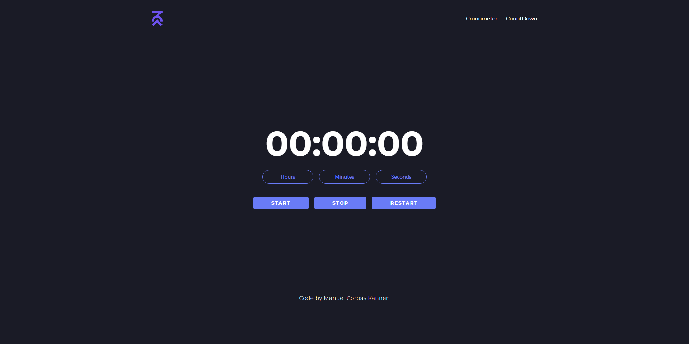

# ☕ JS TIME CONTROL

## ℹ️ About the challenge.
This project marks my initial foray into JavaScript development, where I set out to challenge myself by creating a countdown timer and a chronometer. As a beginner in JavaScript, I aimed to grasp fundamental concepts such as time-related functions and DOM manipulation while building practical applications.

## 📸 Screenshots

  

  

## 💬 Feedback

If you have any feedback, please reach out to me at info@manuelck.com or DM On [Twitter](https://twitter.com/manuelck_)
