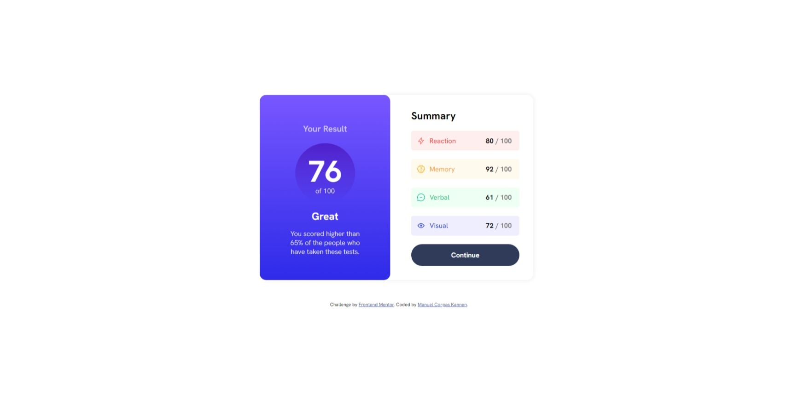
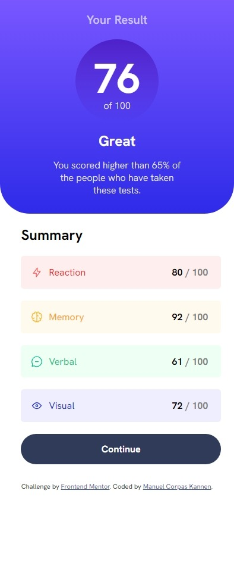

# ☕ Results Summary Component
In this challenge, I had to recreate in Html and CSS a result component.
This challenge helped me to get more comfortable with styling. Still, the final code requires to use a grid, and I did not use any at all. I used flex box. So I will put myself to learn grid in a proper way and update the code.

## 📸Screenshots

  

  

## 🖊️ Challenge author.
 - [Front End Mentor](https://www.frontendmentor.io/home)

## 💬 Feedback

If you have any feedback, please reach out to me at info@manuelck.com or DM On [Twitter](https://twitter.com/manuelck_)
